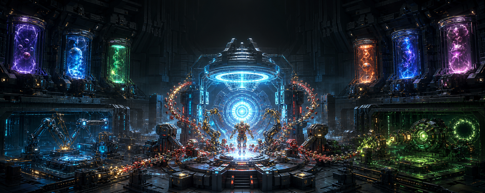
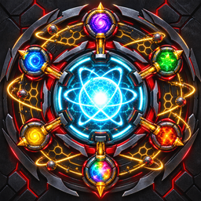

<p align="center"></p>

<p align="center"></p>

# DrakesNanotech

**Programmable matter. ARC engineering. Gamma science. Cosmic containment.**

DrakesNanotech is an ultra-endgame Slimefun expansion for Minecraft 1.21.11. It builds a long,
interconnected technology tree instead of handing out overpowered toys: recover broken servos,
wind palladium coils, synthesize programmable matter, assemble owner-bound suits, contain gamma
isotopes, and only then begin the six cosmic artifact programs.

The addon is built for servers that want spectacular abilities without accepting grief, random
player kills, invisible attacks, or particle lag.

## Heroes & Cataclysms 0.2.0

- **93 registered Slimefun entries:** components, weapons, hero equipment, suits and artifacts plus
  12 fully documented machine heads.
- **Seven branches:** Salvaged Technology, ARC, Nanotech, Gamma, Wakandan Engineering,
  Latverian Techno-Arcana and Cosmic Containment.
- **ARC combat:** the Repulsor Emitter renders a visible cyan ray, impact flash and knockback;
  its target predicate categorically excludes players.
- **Cosmic exposure:** holding any bare Stone starts a clear action-bar countdown, escalating
  distortion and a carrier-only terminal effect. Capsules and gauntlets are the intended answer.
- **Launch suit program:** Mark I, Mark III, Mark V, Mark XLII, Mark L, Hulkbuster and Rescue
  components establish distinct future mechanics instead of cosmetic recolors.
- **Spider program:** Classic, Stealth and Iron Spider suit foundations, Web Shooter, Spider-Sense
  node and articulated waldo modules.
- **Tactical heroes:** Hawkeye smart bow and five arrow systems; Widow's Bite, electroshock baton,
  line launcher and cloaking mesh.
- **Ultron program:** sandboxed AI core, primary shell, sentinel pod, Infinity convergence core and
  a creature-only sky-splitting beam.
- **Mystic engineering:** Sling Ring, levitation cloak, Crimson Bands, Mirror Dimension prism,
  Chronal Eye replica and reversible-looking reality fractures.
- **Cinematic WMDs:** Orbital Sky Lance, Celestial Nullifier, Singularity Warhead, Nanite
  Disassembler and Dimensional Breach Charge—spectacular effects with zero block mutation.
- **Machine-grade documentation:** every machine item states tier, branch, J/t, buffer, duration,
  batch size, input, output, hazard, containment and exact shutdown behavior.
- **Original branding:** production-ready icon and wide banner are included under `docs/assets`.

## Technology tree

| Tier | Program | What it proves |
|---:|---|---|
| 0 | Salvaged Technology | Precision parts and basic control hardware |
| 1 | Stark Engineering | High-density coils and stable ARC power |
| 2 | Programmable Matter | Cleanroom synthesis and nanocell programming |
| 3 | Gamma Science | Radiation control, mutation safety and heavy containment |
| 4 | Exotic Materials | Synthetic vibranium, new element and techno-arcana |
| 5 | Cosmic Containment | Boss fragments, domain analysis and 500 MJ+ processes |
| 6 | Universal Engineering | Six artifacts, gauntlet platforms and the Universal Forge |

Difficulty comes from infrastructure, energy, hazards and boss-bound materials—not from asking for
five double chests of the same ingot.

## Machines that explain themselves

Single-block machines are `PLAYER_HEAD` items with a texture value and stable Slimefun/PDC identity.
They are designed to become proper electric processors in the next implementation pass while their
public contract is already stable. A machine description always answers:

1. What technology tier and branch is this?
2. How much power does it draw and buffer?
3. What enters, what exits, how long does it take and what is the batch size?
4. What hazard and containment level apply?
5. Why did it stop, and what exactly happens during failure?

See the complete [Machine Field Manual](docs/MACHINES.md).

## Safety is part of the fantasy

- Players are never valid Repulsor or future Snap targets.
- No ability calls Bukkit block explosions.
- Every large-area weapon scans WorldGuard and ProtectionStones before rendering or damaging.
- A configurable 24-block buffer rejects use near any protected region, including the user's own.
- Protection lookup errors fail closed: the weapon aborts instead of guessing that an area is safe.
- Cosmic exposure damages only the person deliberately holding the bare artifact.
- Effects use bounded loops and do not load chunks.
- Stable IDs use Slimefun/PDC, never display names.
- WorldGuard, ProtectionStones, NPC and grave adapters are explicit roadmap gates before destructive
  mining or large-area abilities can be enabled.

## Requirements

- Java 21
- Paper 1.21.11
- Drakes Slimefun Core 11.0 (`Slimefun` plugin)

Optional integrations planned or detected: WorldGuard, ProtectionStones, DrakesBosses and
DrakesArcana.

## Build

```bash
mvn clean verify
```

The Drakes Slimefun Core artifact must be available in Maven Local. On the Drakes development
workspace it is installed from `Slimefun4-Drake` with `mvn -DskipTests install`.

## Roadmap

- **0.2 Heroes and House of Stark:** real energy storage, suit-up sequences, Spider traversal,
  tactical arrow cartridges, flight heat, Unibeam, shields, War Machine and Rescue.
- **0.3 Gamma Protocol:** operating processors, exposure storage, controlled Banner mutation,
  Hulkbuster modules and gamma boss drops.
- **0.4 Sovereign Technologies:** Wakandan kinetic weave, Doom forge, Doombots, Ultron encounters,
  synthezoids and mystic engineering.
- **0.5 Infinity:** six independent boss chains, capsules, gauntlet GUI, safe PvE Snap and audit log.
- **0.6 Beyond Time:** Pym/Kang engineering, temporal anchors and the Universal Forge.

The design backlog already covers more than 120 distinct items; releases remain chapter-based so
every recipe, PDC state, protection boundary and effect budget can be tested before production.

## License and trademarks

Source code is © DrakesCraft Labs. This is an original, unofficial science-fantasy addon and is not
affiliated with or endorsed by Marvel, Mojang or Microsoft. It does not ship official logos,
character likenesses or copied game assets.
